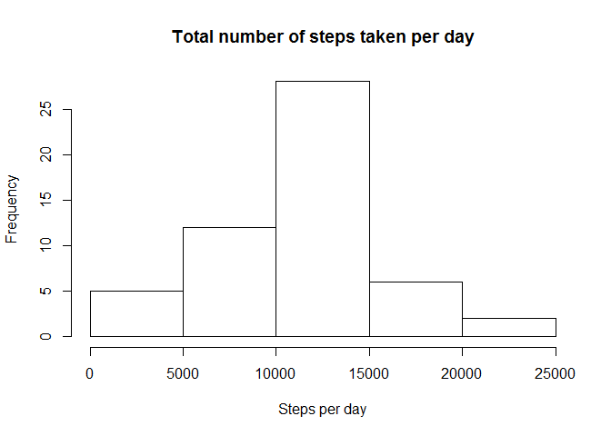
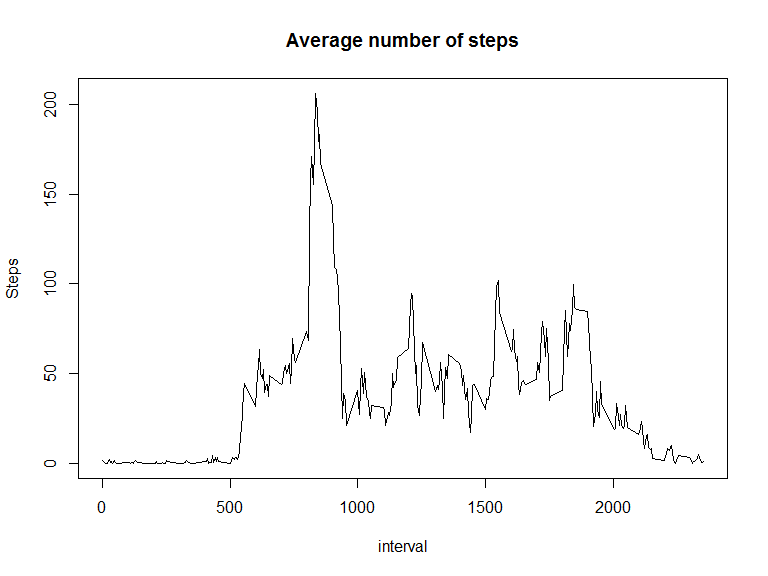
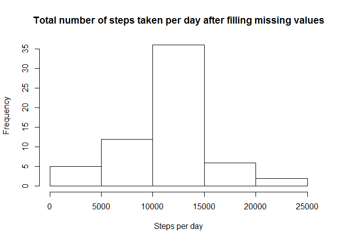
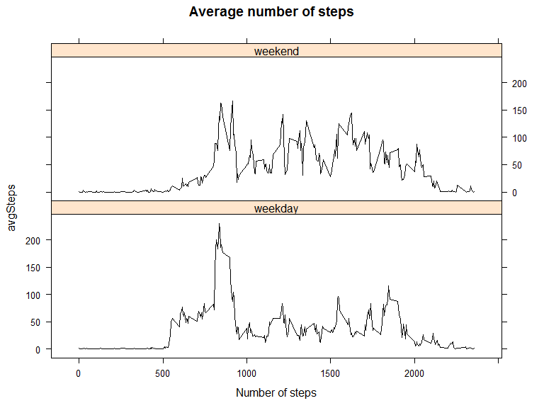

# Reproducible Research: Peer Assessment 1


## Loading and preprocessing the data


```r
library(lubridate)
library(lattice)
unzip("activity.zip")
activity <- read.csv("activity.csv",colClasses = c("numeric","Date","numeric"))
```

## What is mean total number of steps taken per day?
 Histogram of the total number of steps taken per day

```r
stepsPerDay <- aggregate(activity$steps, by=list(activity$date), FUN=sum)[,2]
hist(stepsPerDay,
     main="Total number of steps taken per day",
     xlab="Steps per day")
```

 

 Mean of the total number of steps taken per day

```r
mean <-mean(stepsPerDay,na.rm=TRUE)
mean
```

```
## [1] 10766.19
```
 Median of the total number of steps taken per day

```r
median<-median(stepsPerDay,na.rm=TRUE)
median
```

```
## [1] 10765
```

## What is the average daily activity pattern?

 Time series plot of the 5-minute interval and the average number of steps taken, averaged across all days


```r
aveSteps<-aggregate(activity$steps, by=list(activity$interval),
                    FUN=mean,na.rm=TRUE)[,2]
with(activity,
     plot(unique(interval),aveSteps,
          type="l",
          main="Average number of steps",
          ylab="Steps",
          xlab="interval"))
```

 

 5-minute interval which contains the maximum number of steps

```r
unique(activity$interval)[aveSteps==max(aveSteps)]
```

```
## [1] 835
```

## Imputing missing values

Number of missing values (rows with NAs)


```r
naRows<-with(activity,activity[is.na(steps)|is.na(date)|is.na(interval),])
nrow(naRows)
```

```
## [1] 2304
```

Filling in missing values in the dataset.
Replacing NAs with rounded mean for correcponding 5-minute interval


```r
activityFull<-activity
for (i in 1:length(activityFull$steps)) {
        if (is.na(activityFull$steps[i])) {
              activityFull$steps[i]<-
              round(aveSteps[unique(activity$interval)==activity$interval[i]])
            }
       }
```

 Histogram of the total number of steps taken per day after filling missing values


```r
stepsPerDayFull <- aggregate(activityFull$steps, by=list(activityFull$date), FUN=sum)[,2]
hist(stepsPerDayFull,
     main="Total number of steps taken per day after filling missing values",
     xlab="Steps per day")
```

 

 Mean of the total number of steps after filling missing values

```r
mean <-mean(stepsPerDayFull,na.rm=TRUE)
mean
```

```
## [1] 10765.64
```
 Median of the total number of steps after filling missing values

```r
median<-median(stepsPerDayFull,na.rm=TRUE)
median
```

```
## [1] 10762
```

## Are there differences in activity patterns between weekdays and weekends?

Creating  new factor variable indicating whether a given date is a weekday or weekend day.


```r
activityFull$wday <- wday(activityFull$date)
activityFull$wday[activityFull$wday %in% 2:6] <-"weekday"
activityFull$wday[activityFull$wday %in% c("1","7")] <-"weekend"
activityFull$wday <- as.factor(activityFull$wday)
```

Plot of the 5-minute interval  and the average number of steps taken, averaged across all weekday days or weekend days


```r
#calculate average number of steps
weekday<-activityFull[activityFull$wday=="weekday",]
weekend<-activityFull[activityFull$wday=="weekend",]
weekdaySteps<-aggregate(weekday$steps, by=list(weekday$interval),
                    FUN=mean)[,2]
weekendSteps<-aggregate(weekend$steps, by=list(weekend$interval),
                    FUN=mean)[,2]

#building data frame for xyplot()
df<-as.data.frame(rbind(cbind(weekdaySteps,
                              unique(weekday$interval),rep("weekday")),
            cbind(weekendSteps,
            unique(weekend$interval),rep("weekend"))
            ),stringsAsFactors = FALSE
)
names(df)<-c("avgSteps","interval","wday")
df$avgSteps <- as.numeric(df$avgSteps)
df$interval <- as.numeric(df$interval)
df$wday     <- as.factor(df$wday)


#scatterplot
xyplot(avgSteps~interval|wday,df,
          layout=c(1,2),
          type="l",
          xlab="Number of steps",
          main="Average number of steps",
          col="black")
```

 
